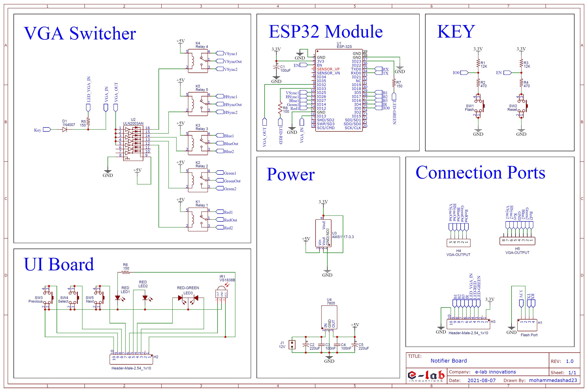

Main project - 2020-21

## Features

  * IoT

## Hardware
### Schematic

### PCB Layout
[PCB_Layout.pdf](Hardware/Hardware/PCB_Layout.pdf)

### 3D View
[Live View](https://elabins.com/SCNotifier/Hardware/Hardware/3D_Design/index.html)

  
## Versions
### V4.0.0 
  * FabGl library with canvas for VGA
  * WebSocket for geting data from the sever
  * Node-red server is used as backend server and frontend dashboard
  * Update screen by reading time and also with using manual buttons
  * Google Apps Script and Google Sheet are using as database and API for server
  * **Data**
    * Current periode
    * Class notification (Editable)
    * HOD notification (Editable)
    * Collage notification (Editable)
    * gptcthirurangadi.in flash news
    * sbte notification
    * sittter notification
    * current weather details
  * **_IR receiver not working_**
    
### V3.0.0 (abandoned)
  * FabGl library with canvas for VGA
  * Server create notifications as jpg image and then esp32 downloads each pages and show to the display
  * Node-red server is used as backend server and frontend dashboard
  * Update screen by reading time and also with using manual buttons
  * Google Apps Script and Google Sheet are using as database and API for server
  * **Data**
    * Current periode
    * Class notification (Editable)
    * HOD notification (Editable)
    * Collage notification (Editable)
    * gptcthirurangadi.in flash news
    * sbte notification
    * sittter notification
    * current weather details
  * **_Image is not clear with 8 colours and also low quality_**

### V2.0.0  (abandoned)
  * FabGl library with text terminal for VGA
  * WebSocket for geting data from the sever
  * Nodejs with ExpressJs server is used as backend server and frontend dashboard
  * Update screen by reading time.
  * Google Apps Script and Google Sheet are using as database and API for server
  * **Data**
    * Current periode
    * Class notification (Editable)
    * HOD notification (Editable)
    * Collage notification (Editable)
    * gptcthirurangadi.in flash news
    * sbte notification
    * sittter notification
  * **_Only support text on the screen_**

### V1.0.0 (abandoned)
  * ESP32Lib library for VGA
  * WebSocket for geting data from the sever
  * Node-red server is used as backend server and frontend dashboard
  * Google Apps Script and Google Sheet are using as database and API for server
  * **Data**
    * Current periode
    * Class notification (Editable)
    * HOD notification (Editable)
    * Collage notification (Editable)
    * gptcthirurangadi.in flash news
    * sbte notification
    * sittter notification
  * **_Poor graphics_**
  
## People

  * Mohammed Ashad MM
  * Aswin Rosh
  * Mohammed Rabeegu
  * Mohammed Afeed
  * Rabeebu Rahman

## License